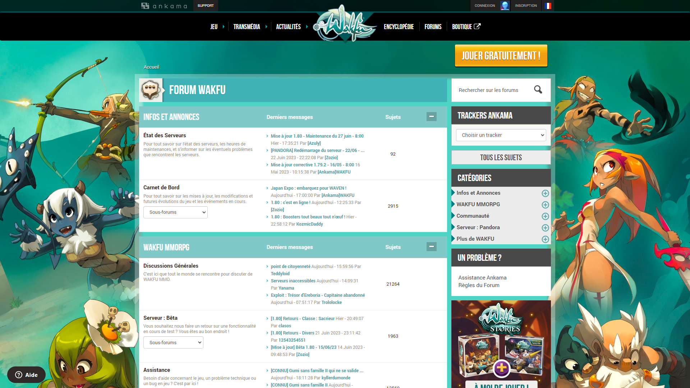

<div id="top"></div>

[![Contributors][contributors-shield]][contributors-url]
[![Forks][forks-shield]][forks-url]
[![Stargazers][stars-shield]][stars-url]
[![Issues][issues-shield]][issues-url]
[![MIT License][license-shield]][license-url]
[![LinkedIn][linkedin-shield]][linkedin-url]

<!-- PROJECT LOGO -->
<br />
<div align="center">
  <a href="https://github.com/PoulpY2K/wakfu-forum-scraper">
<h3 align="center">Wakfu Forum Scraper</h3>
  </a>

  <p align="center">
    Wakfu Forum Scraper est un projet de web scraping en Javascript, codé pour une communauté de jeu de rôle sur le jeu Wakfu afin de fournir un feed en temps réel des posts du forum.
    <br />
    <a href="https://github.com/PoulpY2K/wakfu-forum-scraper"><strong>Explorer la documentation »</strong></a>
    <br />
    <br />
    <a href="https://github.com/PoulpY2K/wakfu-forum-scraper">Voir démo</a>
    ·
    <a href="https://github.com/PoulpY2K/wakfu-forum-scraper/issues">Reporter des bugs</a>
    ·
    <a href="https://github.com/PoulpY2K/wakfu-forum-scraper/issues">Demander une fonctionnalité</a>
  </p>
</div>

<!-- TABLE OF CONTENTS -->
<details>
  <summary>Sommaire</summary>
  <ol>
    <li>
      <a href="#à-propos-du-projet">À propos du projet</a>
      <ul>
        <li><a href="#construit-avec">Construit avec</a></li>
      </ul>
    </li>
    <li>
      <a href="#mise-en-route">Mise en route</a>
      <ul>
        <li><a href="#prérequis">Prérequis</a></li>
        <li><a href="#installation">Installation</a></li>
      </ul>
    </li>
    <li><a href="#licence">Licence</a></li>
    <li><a href="#contact">Contact</a></li>
  </ol>
</details>

<!-- ABOUT THE PROJECT -->

## À propos du projet

Wakfu Forum Scraper est un projet dédié à la communauté roleplay "La Potion de Rappel" sur le jeu Wakfu, 
et permet de scraper trois topics spécifiques du forum afin d'envoyer les nouvelles réponses dans des salons Discord respectifs via un webhook.

Le site web officiel de Wakfu est la propriété d'Ankama Games.

<p align="center">
  
</p>

### Construit avec

- [Typescript](https://www.typescriptlang.org/)
- [Docker](https://www.docker.com/)

<p align="right">(<a href="#top">Revenir au début</a>)</p>

<!-- GETTING STARTED -->

## Mise en route

### Prérequis

- Docker installé sur la machine cible
- Il faut posséder trois clefs et ID de webhooks sur un serveur Discord afin de les ajouter dans le fichier ``.env``

### Installation

1. Cloner le dépôt
   ```sh
   git clone https://github.com/PoulpY2K/wakfu-forum-scraper.git
   ```

2. Copier le fichier ``.env.example``
   ```sh
   cp .env.example .env
   ```
   
3. Remplir le fichier ``.env`` avec vos informations (Base de données, webhooks)

4. Construire et démarrer le conteneur Docker
   ```sh
   docker compose up -d
   ```

<p align="right">(<a href="#top">Revenir au début</a>)</p>

<!-- LICENSE -->

## Licence

Distribué sous la Licence MIT. Voir `LICENSE.md` pour plus d'informations.

<p align="right">(<a href="#top">Revenir au début</a>)</p>

<!-- CONTACT -->

## Contact

Jérémy Laurent - [@PoulpY2K](https://twitter.com/PoulpY2K) - contact@jeremy-laurent.com

Lien du projet: [https://github.com/PoulpY2K/wakfu-forum-scraper](https://github.com/PoulpY2K/wakfu-forum-scraper)

<p align="right">(<a href="#top">Revenir au début</a>)</p>

<!-- MARKDOWN LINKS & IMAGES -->
<!-- https://www.markdownguide.org/basic-syntax/#reference-style-links -->

[contributors-shield]: https://img.shields.io/github/contributors/PoulpY2K/movies-swift-ui.svg?style=for-the-badge
[contributors-url]: https://github.com/PoulpY2K/wakfu-forum-scraper/graphs/contributors
[forks-shield]: https://img.shields.io/github/forks/PoulpY2K/movies-swift-ui.svg?style=for-the-badge
[forks-url]: https://github.com/PoulpY2K/wakfu-forum-scraper/network/members
[stars-shield]: https://img.shields.io/github/stars/PoulpY2K/movies-swift-ui.svg?style=for-the-badge
[stars-url]: https://github.com/PoulpY2K/wakfu-forum-scraper/stargazers
[issues-shield]: https://img.shields.io/github/issues/PoulpY2K/movies-swift-ui.svg?style=for-the-badge
[issues-url]: https://github.com/PoulpY2K/wakfu-forum-scraper/issues
[license-shield]: https://img.shields.io/github/license/PoulpY2K/movies-swift-ui.svg?style=for-the-badge
[license-url]: https://github.com/PoulpY2K/wakfu-forum-scraper/blob/main/LICENSE.txt
[linkedin-shield]: https://img.shields.io/badge/-LinkedIn-black.svg?style=for-the-badge&logo=linkedin&colorB=555
[linkedin-url]: https://www.linkedin.com/in/j%C3%A9r%C3%A9my-laurent-0986981b8/